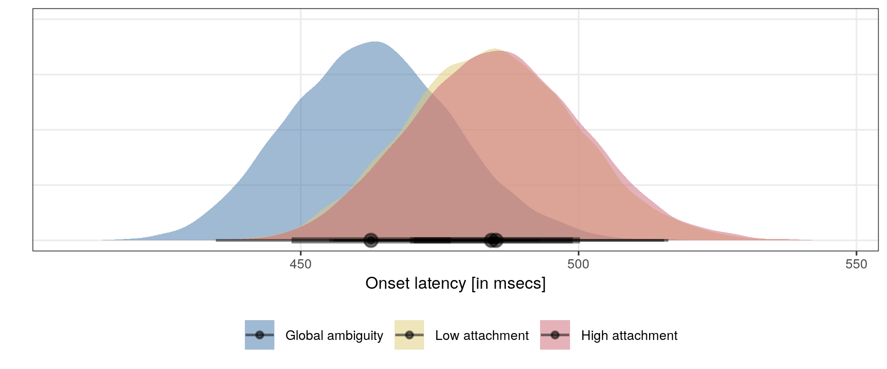
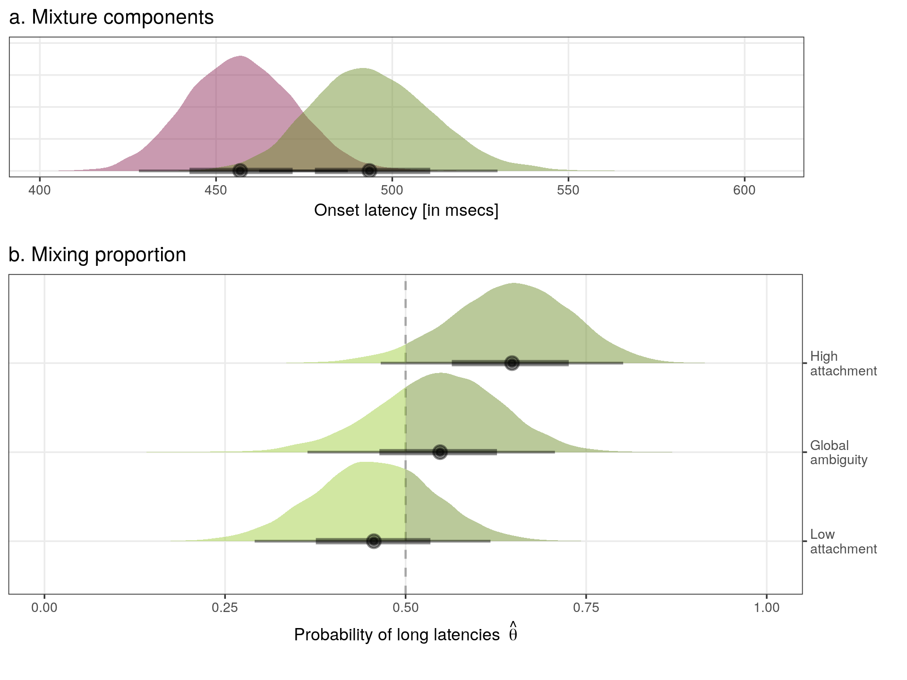

```{r setup, include=FALSE}
knitr::opts_chunk$set(echo = FALSE, warning = FALSE, message = FALSE)
```

```{r}
library(citr)
library(tidyverse)
library(kableExtra)
# CRTL + Shift + R for citations
```

# Overview

This manuscript shows an overview of Stan implementations that contrast different theories of how sentences with different syntactic dependencies affect recall-latencies. In general we compare traditional statistical approaches, here Linear mixed effects models (LMMs), to an extension to mixture models. The rationale for this comparison is that (significant) differences seen between different syntactic attachment types as determined in LMMs come with the implication that a difference is systematic. In other words, these differences are related to the processing of of particular syntactic configurations. This is not necessarily the case. Syntax processing might be non-deterministic in the sense that a specific structural configuration can be processed in different ways depending on experience, task demands etc. Some structural configurations might be more likely to result in processing difficulty. 

For example, when reading a garden-path sentence such as _While the man hunted the deer run into the woods_ people often mistake 'the deer' as syntactic object of 'hunted' during the first parse [@christianson2001thematic; @christianson2006younger]. While these sentences are more likely to elicit such a garden-path effect, not every reader will parse the syntax of this sentence incorrect [@logavcev2016multiple; @logavcev2016understanding]. In other words, the occurrence of a garden-path effect is not entirely specific to structural configurations as implied by processing models such as Garden-Path theory.

For language production, we have observed that response latencies for a paradigm that has been used to argue for an obligatory noun phrase scope [@martin2010planning; @martin2014working; @roeser2019advance; @smi99; @wag10; @wheeldon2012] can be better account for by mixture models, demonstrating that advance syntactic planning is more likely for certain configuration but not obligatory [@roeser2019no]. In other words, not every participant in every trial preplans on a noun phrase levels.

Mixture models allows us to incorporate this possibility and therefore map to an assumed underlying mental process that does not assume that every syntactic structure is processed in an identical manner across participants and sentence (e.g. lexical content). In the following we test different statistical implementations of sentence comprehension and production theory to test how syntactic attachment ambiguity affects sentence-recall latencies.


# Design

The statistical implementations that are described below are written for recall-latency data with the following design in mind. Participants (_N_=160) read sentences and had to recall them from memory. The dependent variable is the time participants required, after reading the sentence, to initiate the recall (typing onset). The stimulus material consisted of 24 simplified items taken from @vanGompel2001reanalysis with attachment type (levels: global ambiguity, high attachment, low attachment) as independent variable. 


1. The caretaker cleaned the pail with the brush. -- __global ambiguity__
2. The caretaker cleaned the suit with the brush. -- __high attachment__ 
3. The caretaker cleaned the pail with the holes. -- __how attachment__

Global ambiguities (1) are sentences with two possible interpretations of which one corresponds to a high attachment and the other to a low attachment interpretation. For the high attachment interpretation the PP 'with the brush' is the instrument of the VP 'cleaned' and the only possible interpretation of (2). In low attachment interpretations, the PP modifies the object NP 'the pail' which is the only possible interpretation of (3).


# Model descriptions

The following models aim to compare different predictions on how attachment ambiguities affect recall-onset latencies. Data were analysed in Bayesian models [@gelman2014;@mcelreath2016statistical]. All models were implemented in the probabilistic programming language Stan [@carpenter2016stan;@hoffman2014no]. Models were fitted with weakly informative priors [see @mcelreath2016statistical] and run with 8,000 iterations on 3 chains with a warm-up of 4,000 iterations and no thinning. Model convergence was confirmed by the Rubin-Gelman statistic [@gelman1992] and inspection of the Markov chain Monte Carlo chains. All scripts and Stan models with the names identified below can be found on [GitHub](https://github.com/jensroes/Sentence-recall).

For all models we assume that onset latencies vary across participants $I$. The variance associated with $i$s participants is $u_i$ and is normal distributed around 0 with a between participants variance $\sigma_u^2$, i.e. $u_i \sim Normal(0, \sigma_u^2)$ where $i = 1, \dots, I$. Similarly each item $j$ (sets of stimulus sentences) with $j = 1, \dots, J$ has a variance $w_j$ that is distributed around 0 with a between item variance $\sigma_w^2$, i.e. $w_j \sim Normal(0, \sigma_w^2)$. Participants and items are added to the models as random intercepts [@barr2013random;@bates2015parsimonious]. Further we assume that the onset latency comes from a log-normal distribution.

## Linear mixed effects models

First, we fitted two LMMs to determine the evidence for a systematic difference between attachment types. This can be done by comparing two LMMs, one that includes attachment type as predictor term and another model without predictor. The latter is a model of the the onset latency _y_ with two parameters, the mean onset latency $\mu$ and the error variance $\sigma^2$. This basic model of the onset latency can be summarised as in equation \@ref(eq:lmm0) [see stanin/LMM0.stan].

$$
y_{ij} \sim LogNormal(\mu + u_i + w_j, \sigma^2)
(\#eq:lmm0)
$$

To evaluate whether different attachment types (global ambiguous, high attachment, low attachment) systematically affect the onset latency, we can introduce the index $k$ with $k \in \{1,2,3\}$ to derive a different mean for each condition as in \@ref(eq:lmm) [see stanin/LMM.stan]. 

$$
y_{ijk} \sim LogNormal(\mu_{k} + u_i + w_j, \sigma^2)
(\#eq:lmm)
$$

LMMs as well as more traditional statistical tests (e.g. ANOVAs, _t_-tests) aim to test whether there is a systematic differences between group. We could now compare \@ref(eq:lmm0) and \@ref(eq:lmm) to test whether adding a different mean for each attachment type increased the quality of the model. If assuming different means for each attachment type does indeed increase the quality of the model, we can conclude that there is a systematic difference in how people recall different attachment types. This was indeed the case as shown in Table \@ref(tab:tablemc) in the Model comparison section.

In the mixture models presented in the next section, we will introduce the assumption that longer latencies are associated with a larger variance. In other words, we do no longer assume homoscedasticity. The reason for this is that larger values from reaction-time data specifically [@wagenmakers2007linear] and human motor behavior in general [@schoner2002timing; @wing1973response] are associated with a larger variance. To allow for a fair comparison from LMMs to mixture models, we therefore implemented a heteroscedastistic version of the previous model. For our design we constraint the variance parameter such that the variance for global ambiguities $\sigma_1^2$ was smaller than the variance $\sigma_2^2$ for attachment types with only one correct interpretation (high and low attachment). This can be seen in \@ref(eq:lmmvar) [see stanin/LMMvar.stan].


$$
y_{ijk} \sim
\begin{cases}
  LogNormal(\mu_{k} + u_i + w_j, \sigma_1^2) & \text{if } k = \text{Global},\\
  LogNormal(\mu_{k} + u_i + w_j, \sigma_2^2) & \text{otherwise}.
\end{cases}
(\#eq:lmmvar)
$$


## Mixture of Gaussians

As described above, standard statistical approaches aim to test whether there is a systematic difference between condition. In our mixture model implementations we are no longer testing whether the difference between attachment types is systematic but whether a slowdown in latencies is more likely to occur for certain attachment types. The code for the mixture models is based on @vasishth2017. While LMM and more traditional statistical tests such as ANOVAs and the _t_-test assume that the data come from a normal distribution, mixture models allow us to make the assumption that the data come from a combination of distributions. In this case, we assumed before that the onset latencies are generated from a single process. This assumption will be contrasted with a Mixture of Gaussians distributions. We test whether the process that generates the onset latencies is better accounted for by a combination of two log-normal distributions. These distributions were constrained such that one distribution is $\mu$ and the onset latency of the other distribution is a $\delta$ increment of $\mu$; i.e. $\mu + \delta$. Mixture models have an additional parameter $\theta$ that captures the mixing proportion of both distributions and ranges from 0 to 1, or indeed .001 and .999 for real mixtures [@gelman2014]. In our models, $\theta$ indicates the proportion of long latencies. As described above we assume that longer latencies are associated with a larger variance which was constraint as $\sigma_2^2 > \sigma_1^2$. A basic version of this mixture model that does not assume differences associated with attachment type is \@ref(eq:mog0) [see stanin/MoG0.stan].


$$
	y_{ij} \sim
		\begin{cases} 
		\theta \cdot LogNormal(\mu + \delta + u_i + w_j, \sigma_{2}^2)\\
		(1 - \theta) \cdot LogNormal(\mu + u_i + w_j, \sigma_{1}^2)
		\end{cases}
		(\#eq:mog0)
$$

As can be seen in \@ref(eq:mog0), the distribution with the increment $\delta$ is assumed to have a mixing proportion $\theta$. The inverse $1-\theta$ is the mixing proportion of latencies without $\delta$. 

We can use this mixture model to implement different hypotheses about how syntax affects recall latencies. It has been widely assumed that syntactic parses rapidly loose activation [@christiansen2016now] that can be (re)generated from conceptual representations [@lombardi1992regeneration;@potter2012conceptual;@potter1998syntactic;@potter1990regeneration;@potter1993very]. From the production literature we can predict [but see @ferreira2006handbook], that when the syntactic encoder cannot operate incrementally, i.e. for more complex syntactic configurations [e.g. @martin2010planning;@not10;@not07;@roeser2019advance] such as indeed high attachment [@lee13], preplanning demands increase and hence onset latencies are observed to be longer. If sentence recall involves syntactic encoding, we would expect high attachment to require longer onset latencies as low attachment which we will capture in the following model with $\delta$. This prediction is deterministic, thus structure specific, and similar to the LMMs above. For global ambiguities, we do not know whether participants recall a high or low attachment interpretation. Either attachment is possible and hence onset latencies can be assumed to reflect this mixture. The mixing proportion $\theta$ captures the probability of long latencies which, in model \@ref(eq:moghigh) [see stanin/MoGhigh.stan], is assumed to be related to high attachment interpretations.

$$
y_{ij} \sim
\begin{cases} 
\theta \cdot LogNormal(\mu + \delta + u_i + w_j, \sigma_{2}^2)\\ 
(1 - \theta) \cdot LogNormal(\mu + u_i + w_j, \sigma_{1}^2) & \text{if Attachment = Global,} \\
LogNormal(\mu + u_i + w_j, \sigma_{1}^2) & \text{if Attachment = Low,}  \\
LogNormal(\mu + \delta + u_i + w_j, \sigma_{2}^2) & \text{if Attachment = High.}
\end{cases}
(\#eq:moghigh)
$$

From the sentence comprehension literature, we know that global ambiguities are typically being read faster as either interpretation is correct, while sentences with low attachment are more likely to result in a garden-path effect, English natives typically prefer high attachment interpretations [@swets2008underspecification;@traxler1998adjunct;@van2000unrestricted;@vanGompel2001reanalysis]. This, however, does not preclude garden-path effects for high attachment conditions. The following mixture model assumes that low and high attachments have a mixing proportion $\theta_k$ with $k \in \{High, Low\}$ of long latencies that are associated with incorrect interpretation due to interference from [@christianson2001thematic;@christianson2006younger] or the correction of an incorrect parse [@ferreira2001misinterpretations;@logavcev2016understanding;@logavcev2016multiple;@swets2008underspecification]. The implementation of this possibility can be found in \@ref(eq:moggp) [see stanin/MoGhigh.stan].


$$
y_{ijk} \sim
		\begin{cases} 
		LogNormal(\mu + u_i + w_j, \sigma_{1}^2) & \text{if Attachment = Global,}\\
		\theta_k \cdot LogNormal(\mu + \delta + u_i + w_j, \sigma_{2}^2)\\
		(1 - \theta_k) \cdot LogNormal(\mu + u_i + w_j, \sigma_{1}^2) & \text{otherwise. } k \in \{High, Low\}
		\end{cases}
(\#eq:moggp)
$$

The last model tests the possibility that a mixture process is involved in onset latencies of all three attachment types but that the mixing proportion $\theta$ (i.e. the probability of long latencies) varies between conditions. Although we allow the mixing proportion to vary, we assume as in the previous models that the psychological process that leads to a slowdown $\delta$ and the onset latency $\mu$ are the same across conditions. As before we constraints the variance $\sigma_2^2$ for long latencies to be larger than $\sigma_2^2$ for shorter latencies. For the mixing proportion to vary across attachment type, we introduced $k$ as index for $\theta$ such that each attachment type $k \in \{1,2,3\}$. The implementation of this model can be found in \@ref(eq:mog) [see stanin/MoG.stan].


$$
y_{ijk} \sim
	\begin{cases} 
  	\theta_k \cdot LogNormal(\mu + \delta + u_i + w_j, \sigma_{2}^2)\\
		(1 - \theta_k) \cdot LogNormal(\mu + u_i + w_j, \sigma_{1}^2)
	\end{cases}
(\#eq:mog)
$$

The predictions for this model is as followed. Mixture observed in high and low attachment are consistent with both, accounts of off-line attachment or interference during sentence comprehension [@christianson2001thematic; @logavcev2016multiple] but also non-incremental planning during syntactic encoding [@do2019subjecthood; @lee13; @momma2019beyond]. However, and crucially, a mixture in global ambiguities is only expected if the regeneration of a syntactic structure is more process demanding for certain interpretations [e.g. @potter2012conceptual]. As suggested before, more complex syntactic arrangements such as high attachment might be more costly for the syntactic encoder [@all07; @lee13; @martin2010planning; @not10] and thus might lead to longer onset latencies when the sentence was (or indeed had to) preplanning in a non-incremental way for global ambiguities but also for temporary ambiguities. We would expect that the latter would affect low attachment less than high attachment in spite of the preference for high attachment in English.

# Results

## Model comparisons

```{r}
read_csv("loos/modelcomparisons.csv") %>%
  mutate(Models = c("M6", "M7", "M5", "M4", "M3", "M2", "M1"),
         Type = ifelse(Models %in% c("M1", "M2", "M3"), "LMM", "MoG")) %>%
  mutate(Models = recode(Models,  M6 = "\\@ref(eq:mog)",
                                M7 = "\\@ref(eq:mog0)",
                                M1 = "\\@ref(eq:lmm0)",
                                M2 = "\\@ref(eq:lmm)",
                                M3 = "\\@ref(eq:lmmvar)",
                                M4 = "\\@ref(eq:moghigh)",
                                M5 = "\\@ref(eq:moggp)")) %>%
  select(Models, elpd_diff, se_diff) %>%
  rename(`$\\Delta\\widehat{elpd}$` = elpd_diff,
         SE = se_diff) -> mc

```

```{r}
mc[1,] %>% pull(Models) -> best_fit
```


Model comparisons can be found in Table \@ref(tab:tablemc). The predictive performance of the models was evaluated using out-of-sample predictions estimated using Pareto smoothed importance-sampling leave-one-out cross-validation (PSIS-LOO) [@vehtari2015pareto; @vehtari2017practical]. Predictive performance was estimated as the sum of the expected log pointwise predictive density ($\widehat{elpd}$). Model comparisons as expressed as the difference in expected log predictive density ($\Delta\widehat{elpd}$) and standard errors ($SE$). Each difference shows the predictive performance compared to the best fitting model shown in the top row of Table \@ref(tab:tablemc). Importantly, this type of model comparison penalizes complex (i.e. models with more parameters) to avoid over-fitting. Model `r best_fit` showed the highest predictive performance.


```{r tablemc,  results='asis'}
mc %>%  knitr::kable(digits = 2, 
               align =c("l", "r", "r"), 
               caption = "Model comparisons. The Models column shows the equations used for the model description.") %>%
  kableExtra::kable_styling(position = "center", full_width = F) %>%
  column_spec(1, width = "10em") %>%
  column_spec(2:3, width = "5em")

```


## Model posteriors

Figure \@ref(fig:LMM) shows the posterior distribution of the LMM model in equation \@ref(eq:lmm). Although this model was found to have a lower predictive performance than `r best_fit`, it is equivalent to standard analyses in the literature, and should not be neglected for comparability. The LMM model shows a systematic slowdown for sentences with high or low attachment but faster response latencies for global ambiguities.  

```{r LMM, fig.align='center', fig.cap='Posterior probability distributions of the onset latency of the LMM model in equation \\@ref(eq:lmm) by attachment type. Error bars indicate 66\\% and 95\\% posterior probability intervals.', fig.pos='H'}

```

The implication of this model is that the syntactic configuration of sentences with either high or low attachment lead to a slowdown that is due to the adaptation of the incorrect parse. In contrast, this slowdown is not observed for global ambiguities as either parse is acceptable. However, it is unlikely that participants systematically selected high attachment in the low attachment condition and low attachment in the high attachment condition. Instead it is more plausible that the adaptation of the incorrect parse will lead to a slowdown in a subset of trials in a non-deterministic fashion. Indeed we found that the tested mixture models rendered a higher predictive performance compared to the standard analysis (see Table \@ref(tab:tablemc)).

Model `r best_fit` showed the highest predictive performance. Thus we observed a different mixing proportion for each attachment type associated with a larger probability of longer latencies $\delta$. The posterior distributions of the relevant model parameter is shown in Figure \@ref(fig:mog). Figure \@ref(fig:mog)a shows the mixture components that the model determined for the onset latencies with longer latencies $\mu + \delta$ shown in green. More importantly, Figure \@ref(fig:mog)b shows the corresponding mixing proportions $\theta$, i.e. the probability of long latencies for each attachment type.


```{r mog, fig.align='center', fig.cap='Posterior probability distribution of the mixture model \\@ref(eq:mog) with the highest predictive performance. Panel (a) shows the mixture components and panel (b) shows the mixing proportions by attachment type. Error bars indicate 66\\% and 95\\% posterior probability intervals.', fig.pos='H'}

```

All attachment types were found to be a mixture of two distributions. We observed a larger proportion of long latencies for high attachment, a lower proportion for low attachment and an about equal proportion of both for global ambiguities. 


# References